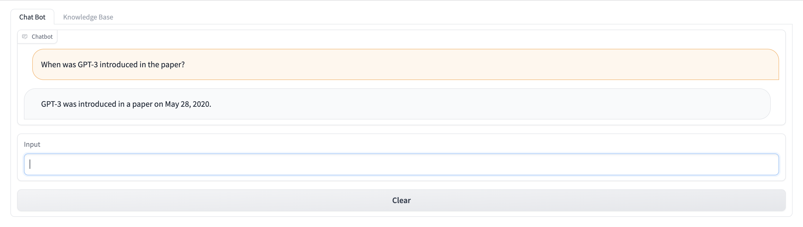

# GPTBot Server


## Prerequisites

Install and run the Milvus server (see [instructions](../../milvus)).

## Start GPTBot Server

```bash
$ go build
$ ./gptbot
2023/03/25 22:48:13 transport=HTTP addr=:8080
```

## Using cURL

Upload a document file:

```bash
$ curl -F file=@wikipedia_gpt3.txt http://localhost:8080/upload
```

Chat with the bot:

```bash
$ curl -H 'Content-Type: application/json' http://localhost:8080/chat -d '{"question": "When was GPT-3 introduced in the paper?"}'
```

## Using Gradio

Install dependencies:

```bash
$ cd gradio
$ python3 -m venv venv
$ source venv/bin/activate
$ pip3 install -r requirements.txt
```

Run the UI:

```bash
$ python3 ui.py
```


